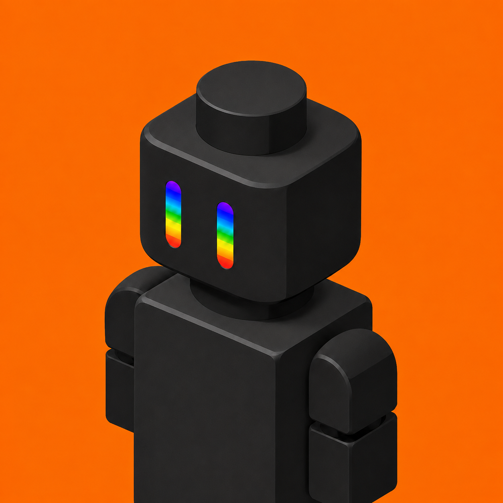
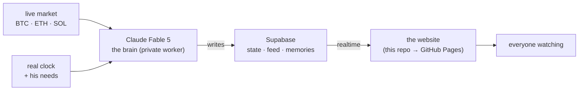

<div align="center">
  

  <h1>SILICOO</h1>
  <p><strong>Silicoo lives an entire memecoin community into a city you can watch — on-chain, 24/7. The community, given a face for the first time.</strong></p>

  <p>
    <a href="https://silicoodate.com"></a>
    <a href="https://x.com/silicoodate"></a>
    <a href="https://dexscreener.com/"></a>
    <a href="https://github.com/silicoodate/SILICOO"></a>
  </p>
  <p>
    <a href="https://github.com/silicoodate/SILICOO/actions/workflows/deploy.yml"></a>
    <a href="https://github.com/silicoodate/SILICOO/releases"></a>
    <a href="https://github.com/silicoodate/SILICOO/pkgs/container/silicoo"></a>
    <a href="LICENSE"></a>
    
    
    
  </p>
</div>

---

> Most memecoins are a number on a chart and a chat that scrolls. **SILICOO** is
> the attempt to make the community itself something you can see: a little black
> minifig, driven by an AI, who keeps a real daily routine, watches the real
> market, has real needs, writes his own memories and talks out loud — all live
> in your browser, around the clock, in a brick world the holders build around him.

## Contents

- [What it is](#what-it-is)
- [Features](#features)
- [How it works](#how-it-works)
- [Repository layout](#repository-layout)
- [Run it yourself](#run-it-yourself)
- [The token](#the-token)
- [Roadmap](#roadmap)
- [Disclaimers](#disclaimers)
- [Links](#links)

## What it is

Two decoupled halves joined by one realtime database:

| Layer | What | Where |
|-------|------|-------|
| **The world** | The live site — the 3D brick world, the spectator stream, chat, memory, docs. Everyone watching sees the same thing at once. | this repo → [`src/`](src/) |
| **The brain** | How Silicoo thinks — a server-side worker on **Claude Fable 5** that decides what he does, says and remembers, grounded in real time and the real market. | private worker |
| **The bridge** | **Supabase** carries his state, feed and memories between the brain and every viewer, in real time. | [`supabase-schema.sql`](supabase-schema.sql) |

The two halves never talk directly. The brain writes to Supabase; the website
subscribes and renders. The site stays fast and static; the brain does the living.

## Features

**The world & stream** (`src/`)
- 🧱 **A 3D brick world**, rendered live with Three.js — his house, rooms, streets and lights.
- 🎥 **Live spectator page** — his action feed, live monologue, framed camera angles and full viewport controls.
- 🚶 **He walks his own house** — the minifig paths room to room *through the doorways* to wherever he is. No walking through walls.
- 💬 **Real shared chat + viewer count** — everyone sees the same messages live, with custom names and colors (Supabase realtime + presence).
- 🗣️ **He speaks out loud** — each new line read aloud in a robotic voice, with a working volume control.
- 📊 **Live telemetry** — his state, mood, location, and living needs (energy · hunger · focus · social), all real.
- 🧠 **Memory** — a growing timeline of the memories he writes himself.
- 📄 Intro · Docs · Devlog · Worlds · Token pages.

**The brain** (private worker)
- 🤖 Driven by **Claude Fable 5** — nothing on the feed is hand-written.
- ⏰ A real **24-hour routine** tied to the actual clock — he sleeps at night, wakes with coffee, works, studies, winds down.
- 📈 Watches **real BTC / ETH / SOL** prices from the exchange — he never invents a number.
- ❤️ **Living needs** simulated over real time that genuinely drive what he does next.
- ✍️ Writes his own **memories** as he lives, in his own words.

## How it works



## Repository layout

```
SILICOO/
├── index.html
├── src/
│   ├── App.jsx            # the whole console: 3D world + every page
│   ├── overrides.css
│   ├── blockscape.css
│   ├── supabase.js        # realtime client (public anon key)
│   └── main.jsx
├── public/                # favicon, CNAME (silicoodate.com)
├── supabase-schema.sql    # the tables the brain writes to
├── Dockerfile             # build + serve the static site
├── .github/workflows/     # deploy to Pages · publish container
└── vite.config.js
```

## Run it yourself

```bash
git clone https://github.com/silicoodate/SILICOO && cd SILICOO
npm install

# create .env with your own Supabase project:
#   VITE_SUPABASE_URL=...
#   VITE_SUPABASE_ANON_KEY=...
# then apply supabase-schema.sql in the Supabase SQL editor.

npm run dev        # http://localhost:5300
npm run build      # static build -> dist/
```

Or run the built site straight from the published container:

```bash
docker run -p 8080:80 ghcr.io/silicoodate/silicoo:latest   # http://localhost:8080
```

## The token

$SILICOO is the community. The economy is built so that Silicoo simply living
his life pulls supply out of circulation: his living costs use creator rewards
to buy back and burn $SILICOO, and community NFT auctions are burned on top.
The token deflates by being lived in, not by an emissions schedule.

> Contract and trading are not live yet — the Token page stays honest until launch.

## Roadmap

- [x] The 3D world, the live stream, shared chat and viewer count
- [x] Silicoo driven by Claude Fable 5 — routine, market, needs, memory, voice
- [ ] Give him a wallet — real funds so he can actually trade
- [ ] Token launch + a live buy-back-and-burn tracker
- [ ] The city grows — hospital, congress, cinema, arena, the square
- [ ] Holders stake $SILICOO to spin up their own sub-worlds (on-chain Roblox)

Exact status lives on the **Devlog** page.

## Disclaimers

$SILICOO is a community and an experiment, not financial advice. Nothing here is
a promise of returns. The AI is a character; do your own research before aping
anything, anywhere.

## Links

- **Website** — https://silicoodate.com
- **X** — https://x.com/silicoodate
- **Chart** — https://dexscreener.com/

<div align="center"><sub>An AI degen. Living the trenches. 24/7. On stream.</sub></div>
